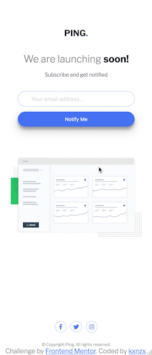

# Frontend Mentor - Ping Coming Soon Page Solution

This is a solution to the [Ping Coming Soon Page Challenge on Frontend Mentor](https://www.frontendmentor.io/challenges/ping-single-column-coming-soon-page-5cadd051fec04111f7b848da). Frontend Mentor challenges help you improve your coding skills by building realistic projects.

## Table of contents

- [Overview](#overview)
  - [The challenge](#the-challenge)
  - [Screenshot](#screenshot)
  - [Links](#links)
- [My process](#my-process)
  - [Built with](#built-with)
  - [What I learned](#what-i-learned)
- [Author](#author)

## Overview

### The challenge

Users should be able to:

- View the optimal layout for the site depending on their device's screen size
- See hover states for all interactive elements on the page
- Submit their email address using an `input` field
- Receive an error message when the `form` is submitted if:
  - The `input` field is empty. The message for this error should say _"Whoops! It looks like you forgot to add your email"_
  - The email address is not formatted correctly (i.e. a correct email address should have this structure: `name@host.tld`). The message for this error should say _"Please provide a valid email address"_

### Screenshot

#### Screensize 1440px - Desktop


#### Screensize 375px - Mobile



### Links

- View my Solution on [Frontend Mentor](https://www.frontendmentor.io/solutions/email-validation-form-with-vanilla-html-css-and-javascript-5diVRcbR_u)
- View the Live Site [here](https://kxnzx.github.io/coming-soon-page/)

## My process

- HTML semantics
- Importing Google Fonts
- Set variables
- Reset default settings
- Styles (Mobile First)
- JavaScript

### Built with

- Semantic HTML5 markup
- JavaScript
- SASS custom properties
- CSS Grid
- CSS Flexbox
- Mobile-first workflow
- Google Fonts - For Fonts
- [Font Awesome](https://fontawesome.com/) - For Social Media Icons

### What I learned

I learned about ARIA = Accessible Rich Internet Applications. This is a set of attributes you can add to HTML elements that makes the web content and applications accessible to users with visual disabilities who use assistive technologies (AT). When accessibility issues cannot be managed with native HTML, ARIA can help bridge those gaps.

There are several Aria attributes. One of them are relationship attributes: these attributes add relationships between elements that can't be determined otherwise. Users of Assistive Technologies use relationship attributes to understand when information is related when navigating a page.

In this project I used two relationship attributes, Aria-labelledby & Aria-describedby:

```html
<h1 id="title">We are launching <span class="bold">soon!</span></h1>
<p id="description">Subscribe and get notified</p>
<form id="form" action="">
  <!-- Included fieldset to be semantically correct, h1 & p are related via aria -->
  <fieldset aria-labelledby="title" aria-describedby="description"></fieldset>
</form>
```

- Aria-labelledby: "this element is labelled by", can be used with any element. The thing that is labelled refers to the thing that labels it. It means that these elements belong to eachother.

- Aria-describedby: this element is described by. To associate the description with the certain element.

- Another ARIA attribute I learned is the aria-hidden. The presence of the aria-hidden attribute hides content from assistive technology but doesn't visually hide anything:

```html
<small role="alert" class="error_message" id="error" aria-hidden="true">
</small>
```

### Email Validation in JavaScript

This project is more challenging than I initially thought.

I was wondering what the difference is between type="button" and type="submit". First it's important to understand what the difference is between Client-side and Server-side.

Client-side = Computer of the client, such as a desktop, laptop, Ipad, tablet, smartphone. Client Computers make requests to Server Computers. Languages: HTML, CSS, JavaScript.

Server-side = Server Computers serve out information to Client Computers. Languages: Python, JavaScript, PhP, SQL, C++ etc.

So to come back to the question when to use type="button" and type="submit"? If you want to submit the form to your server, you should use "Submit". However, if you want to do something from the client side by clicking the "Button", the input type "Button" is the choice.

In this project I used the type="submit", because I could not make it work without it.

I did not succeed in implementing the customized error message "Please provide a valid email address" for when an invalid emailaddress has been entered. Instead I get a standard pop-up error message.

```js
// This tells the browser to pay attention to the following elements:
const form = document.getElementById("form");

// This tells the browser to prevent the form from submitting by default:
form.addEventListener("submit", (e) => {
  e.preventDefault();

  const email = document.getElementById("email");
  const small = form.querySelector("small");
  // The value attribute sets the specified value of the input element:
  const inputEmail = form["email"].value;

  if (!inputEmail) {
    // When the field is left empty, do this:
    email.classList.add("error");
    small.innerText = "Whoops! It looks like you forgot to add your email";
    small.style.display = "inline-block";
  } else if (!isValidEmail(inputEmail)) {
    // When the input is invalid, do this:
    email.classList.add("error");
    small.innerText = "Please provide a valid email address";
    small.style.display = "inline-block";
  } else {
    // When the input is valid, do this:
    email.classList.remove("error");
    small.innerText = "";
    small.style.display = "none";
  }
});
// REGEX = Regular Expression
function isValidEmail(email) {
  var re =
    /^(([^<>()\[\]\\.,;:\s@"]+(\.[^<>()\[\]\\.,;:\s@"]+)*)|(".+"))@((\[[0-9]{1,3}\.[0-9]{1,3}\.[0-9]{1,3}\.[0-9]{1,3}\])|(([a-zA-Z\-0-9]+\.)+[a-zA-Z]{2,}))$/;
  return re.test(String(email).toLowerCase());
}
```

## Author

- Frontend Mentor - [@kxnzx](https://www.frontendmentor.io/profile/kxnzx)
